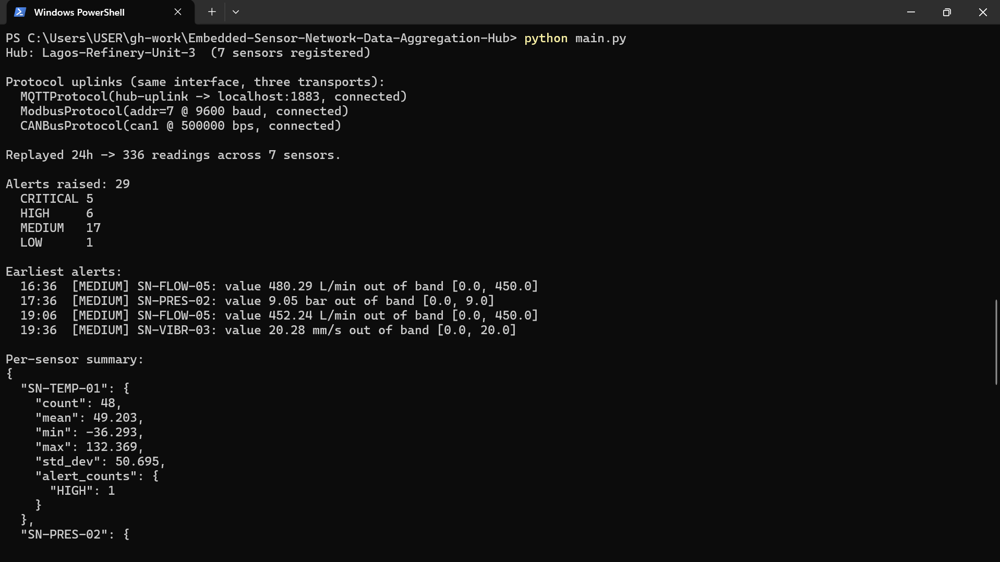
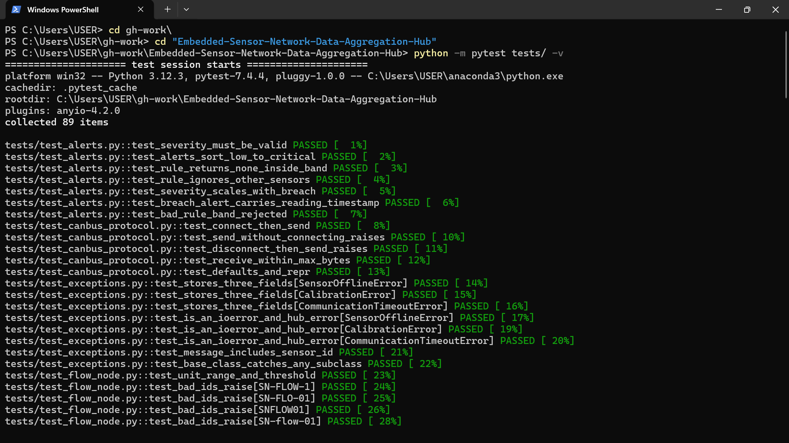

# Embedded Sensor Network Data Aggregation Hub

A multi-protocol industrial-IoT sensor simulation, written in pure-Python OOP
for **CPE 310 — Object-Oriented Programming with Python**, Federal University
Oye-Ekiti (Group 4).

Repository: https://github.com/ikezuefrank/Embedded-Sensor-Network-Data-Aggregation-Hub

---

## 1. Project Title and Overview

**Embedded Sensor Network Data Aggregation Hub** is a command-line Python
application that simulates the kind of heterogeneous sensor network used in
Nigerian manufacturing, oil & gas, and power-generation plants. Five sensor
types — temperature, pressure, vibration, gas concentration and flow rate —
produce readings that travel over three simulated protocols (MQTT, Modbus, CAN
Bus) to a central `AggregationHub`. The hub calibrates each reading, evaluates
configurable threshold rules, queues alerts by severity, tracks battery
depletion on wireless nodes, and exports a JSON-serialisable summary of
everything it has seen. There is no GUI and no database — by design — it is a
tested, documented OOP core that exercises classes, encapsulation, inheritance
(including cooperative multiple inheritance), polymorphism and duck typing.

---

## 2. Team Members — Group 4

| S/N | Surname | Other Names | Matric Number | GitHub Username |
|----|---------|-------------|---------------|-----------------|
| 1 | Emans | Gift Oghenemine | CPE/2023/1043 | emansgift197-star |
| 2 | Emmanuel | Faith Aanuoluwa | CPE/2023/1044 | EmpressFaith |
| 3 | Esan | Samuel Moyinoluwa | CPE/2023/1045 | Sunnie360 |
| 4 | Essien | David Uwem | CPE/2023/1046 | — |
| 5 | Fakorede | Chinedum Temidayo | CPE/2023/1047 | fakoredechi-byte |
| 6 | Falade | Olamide Ebenezer | CPE/2023/1048 | olamidefalade71-max |
| 7 | Falaiye | Tobiloba Kayode | CPE/2023/1049 | FalaiyeAdeshina |
| 8 | Fasuyi | Kingsley Oluwatosin | CPE/2023/1050 | kingsley2244 |
| 9 | Fele | Olamide Micheal | CPE/2023/1051 | Olliboi-01 |
| 10 | Fowowe | Stephen Oluwamodimu | CPE/2023/1052 | jerrysteve207-beep |
| 11 | Ibukunoluwa | Oluwanifemi Favour | CPE/2023/1053 | Ibuksmonii40 |
| 12 | Ikezue | Munachukwu Franknoris | CPE/2023/1054 | ikezuefrank |
| 13 | Ilukoyenikan | Adeolu Joseph | CPE/2023/1055 | Adeolujosef |
| 14 | Istifanus | Godspower Joseph | CPE/2023/1056 | stonejerry2000s |
| 15 | Iwuchukwu | Miracle Oluebube | CPE/2023/1057 | — |

---

## 3. OOP Concepts Demonstrated

| OOP Concept | Location in Code | Week |
|-------------|------------------|------|
| Class design, constructor, `__str__`/`__repr__` | `src/sensors.py`, every `*Node` class (e.g. `TemperatureNode`, lines 106–119) | Week 1 |
| Encapsulation — `sensor_id` validated against `SN-TTTT-NN` | `src/sensors.py`, `SensorNode.__init__`, lines 31–46 | Week 2 |
| `@property` with validation — `calibration_offset` (±10% of full scale) | `src/sensors.py`, `SensorNode.calibration_offset`, lines 57–69 | Week 2 |
| `@property` with validation — `battery_level` (0–100) | `src/sensors.py`, `BatteryPoweredMixin.battery_level`, lines 202–211 | Week 2 |
| Custom exception hierarchy | `src/exceptions.py`, `SensorHubError` + 3 subclasses, lines 11–48 | Week 2 |
| Abstract base class | `src/sensors.py`, `SensorNode(ABC)`, lines 20–54 | Week 3 |
| Abstract base class | `src/protocols.py`, `CommunicationProtocol(ABC)`, lines 15–55 | Week 3 |
| Inheritance — five concrete sensor nodes | `src/sensors.py`, lines 106–183 | Week 3 |
| Inheritance — three concrete protocols | `src/protocols.py`, lines 58–152 | Week 3 |
| Cooperative multiple inheritance + `super()`/MRO | `src/sensors.py`, `WirelessSensorNode`, lines 228–247 | Week 3 |
| Operator overloading — `__add__`/`__radd__`/`__abs__` | `src/readings.py`, `SensorReading`, lines 24–44 | Week 4 |
| `@total_ordering` (`__eq__` + `__lt__` → the rest) | `src/readings.py`, lines 13, 46–55 | Week 4 |
| `__hash__` with custom `__eq__` | `src/readings.py`, lines 46–59 | Week 4 |
| Priority ordering via `__lt__` | `src/alerts.py`, `Alert.__lt__`, lines 31–34 | Week 4 |
| Polymorphism — `__len__`/`__contains__`/`__iter__` | `src/hub.py`, `AggregationHub`, lines 89–96 | Week 4 |
| Duck typing via `typing.Protocol` | `src/pipeline.py`, `Readable` + `DataPipeline.process`, lines 12–24 | Week 4 |
| UML class diagram | `uml/class_diagram.puml`, `uml/class_diagram.png` | Week 5 |

---

## 4. System Architecture


The design is built around two parallel ABC hierarchies and a hub that ties
them together. `SensorNode` defines the sensor interface and the five concrete
nodes only vary their unit, safe range and alarm threshold — so the reading
simulation lives once in the base and each node reuses it. `CommunicationProtocol`
does the same for the three transport stubs. The `AggregationHub` **composes**
its `SensorNode` instances: once a sensor is registered the hub owns it, polls
it and keeps its history, so the part's role is bound to the whole (filled
diamond). By contrast the hub only **aggregates** `AlertRule` objects — rules are
created independently and passed in with `add_alert_rule()`, the hub merely
holds a reference, and the same rule could outlive or be shared beyond one hub
(hollow diamond). `WirelessSensorNode` uses cooperative multiple inheritance
from `SensorNode` and `BatteryPoweredMixin`, relying on Python's MRO and
`super()` so both initialisers run. Polymorphism shows up in two places: the hub
treats every sensor uniformly through the `SensorNode` interface, and
`DataPipeline.process()` accepts anything satisfying the `Readable` protocol
rather than a specific class.

---

## 5. How to Run

```bash
# 1. Clone
git clone https://github.com/ikezuefrank/Embedded-Sensor-Network-Data-Aggregation-Hub.git
cd Embedded-Sensor-Network-Data-Aggregation-Hub

# 2. Create and activate a virtual environment
python -m venv venv
source venv/bin/activate          # Windows: venv\Scripts\activate

# 3. Install dependencies (just pytest)
pip install -r requirements.txt

# 4. Run the demonstration
python main.py

# 5. Run the test suite
pytest tests/ -v
```

Requires Python 3.10 or newer.

---

## 6. Sample Output

Real output from `python main.py` (the run is seeded, so it reproduces):

```
Hub: Lagos-Refinery-Unit-3  (7 sensors registered)

Protocol uplinks (same interface, three transports):
  MQTTProtocol(hub-uplink -> localhost:1883, connected)
  ModbusProtocol(addr=7 @ 9600 baud, connected)
  CANBusProtocol(can1 @ 500000 bps, connected)

Replayed 24h -> 336 readings across 7 sensors.

Alerts raised: 29
  CRITICAL 5
  HIGH     6
  MEDIUM   17
  LOW      1

Earliest alerts:
  16:06  [MEDIUM] SN-FLOW-05: value 480.29 L/min out of band [0.0, 450.0]
  17:06  [MEDIUM] SN-PRES-02: value 9.05 bar out of band [0.0, 9.0]
  18:36  [MEDIUM] SN-FLOW-05: value 452.24 L/min out of band [0.0, 450.0]
  19:06  [MEDIUM] SN-VIBR-03: value 20.28 mm/s out of band [0.0, 20.0]

Per-sensor summary:
{
  "SN-TEMP-01": {
    "count": 48, "mean": 49.203, "min": -36.293, "max": 132.369,
    "std_dev": 50.695, "alert_counts": { "HIGH": 1 }
  },
  "SN-GASC-04": {
    "count": 48, "mean": 18.003, "min": 0.364, "max": 94.243,
    "std_dev": 22.494, "alert_counts": { "CRITICAL": 5, "MEDIUM": 1 }
  },
  "SN-WTMP-06": {
    "count": 48, "mean": 61.896, "min": -36.59, "max": 150.0,
    "std_dev": 60.163, "alert_counts": { "LOW": 1 }
  }
  ... (one block per sensor)
}
```

### Captured from a live run

`python main.py` on Windows PowerShell:



The full test suite — **89 passed**:



---

## 7. Known Limitations

These are deliberate simplifications, not unfinished work:

- **Sensor data is random, not real.** Each `read()` draws a plausible value
  (with an occasional spike to exercise the alert path) instead of replaying a
  recorded trace. Values are reproducible only because `main.py` seeds the RNG.
- **Protocols are in-memory stubs.** `MQTTProtocol`, `ModbusProtocol` and
  `CANBusProtocol` model the connect/send/receive/disconnect lifecycle (and a
  small random connection-timeout) but open no real sockets and move no real
  frames. They demonstrate the polymorphic interface; they are not a network
  stack.
- **Everything is in memory.** Readings and alerts live in the hub for the
  length of one run. There is no persistence, file export beyond the printed
  JSON, or database — the brief does not require one.
- **Battery model is linear.** `discharge_per_reading` is subtracted flat per
  read; there is no temperature/load curve. A low-battery alert is timestamped
  with the wall clock at discharge time, so in a replayed 24-hour run it sorts
  after the (back-dated) threshold alerts.
- **Polling is single-threaded and synchronous.** `poll_all()` reads every
  sensor in turn; there is no concurrency or real-time scheduling.
- **`self_test()` is deterministic** — it passes unless the calibration offset
  has been forced out of range, rather than randomly simulating hardware faults.

---

## 8. References

- Python `abc` module — https://docs.python.org/3/library/abc.html
- `typing.Protocol` / structural subtyping — https://docs.python.org/3/library/typing.html#typing.Protocol
- `functools.total_ordering` — https://docs.python.org/3/library/functools.html#functools.total_ordering
- `datetime` / `timedelta` — https://docs.python.org/3/library/datetime.html
- `statistics` module — https://docs.python.org/3/library/statistics.html
- pytest documentation — https://docs.pytest.org/
- PlantUML class-diagram syntax — https://plantuml.com/class-diagram

---

## Repository Structure

```
Embedded-Sensor-Network-Data-Aggregation-Hub/
├── README.md
├── .gitignore
├── requirements.txt
├── conftest.py
├── main.py
├── src/
│   ├── __init__.py
│   ├── exceptions.py
│   ├── readings.py
│   ├── sensors.py
│   ├── protocols.py
│   ├── alerts.py
│   ├── hub.py
│   └── pipeline.py
├── tests/
│   ├── __init__.py
│   └── test_*.py           # 89 pytest cases
├── uml/
│   ├── class_diagram.puml
│   └── class_diagram.png
└── docs/
    └── design_notes.md
```

**Course:** CPE 310 — Object-Oriented Programming with Python · **Department:**
Computer Engineering, FUOYE · **AY:** 2025/2026 · **Group:** 4 of 10
